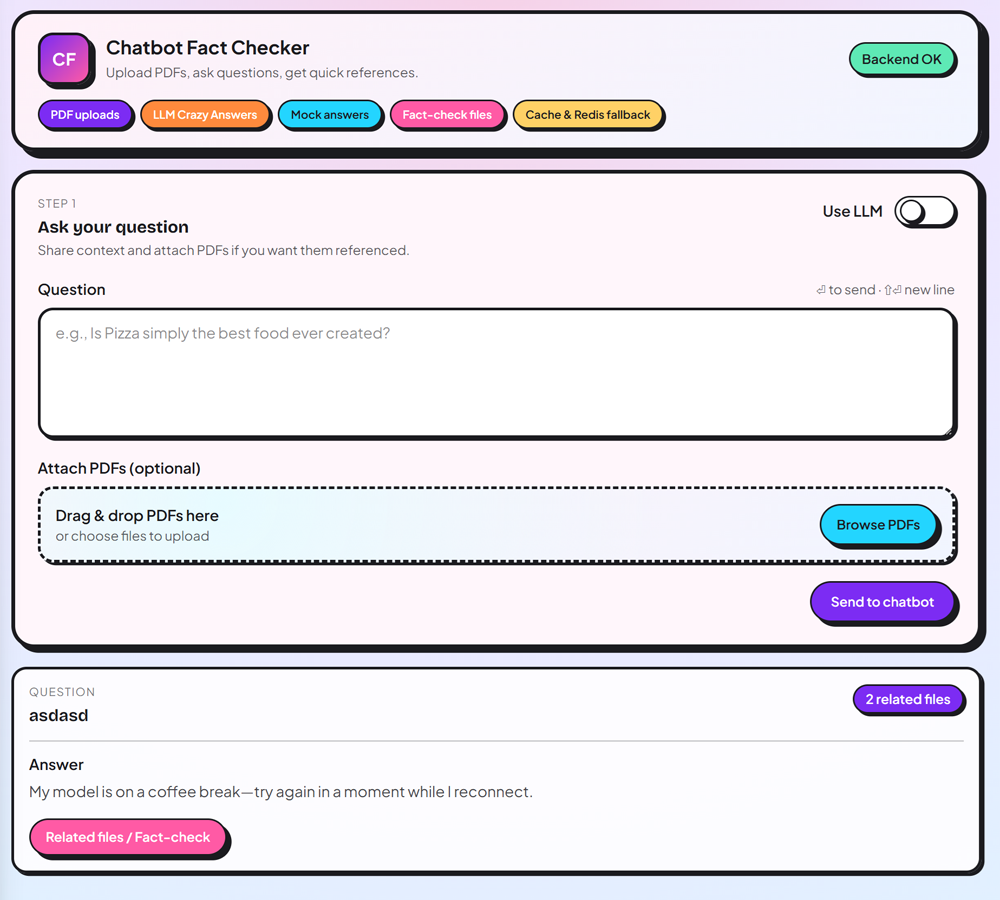

# Chatbot Fact Checker

Upload PDFs, ask a question, get probably a crazy answer from the LLM (if available otherwise a mocked one) and if some files support the answer you will find them listed by clicking on the "related files / Fact-check" button. This is a demo MVP with a React frontend and a FastAPI backend, backed by Redis caching (with automatic in-memory fallback) and a local LLM served by Ollama.



---

## Getting Started
- Fastest path Windows: 
```bash
git clone https://github.com/DevMiki/chatbot-fact-checker.git; cd chatbot-fact-checker; docker-compose up
```

- Fastest path Linux: 
```bash
git clone https://github.com/DevMiki/chatbot-fact-checker.git && cd chatbot-fact-checker && docker-compose up
```


## Tech stack

- **Backend:** FastAPI (Python 3.11), `httpx` for Ollama calls, `uv` for dependency sync
- **Frontend:** React 18 + Vite 5 (dev proxy for `/api`)
- **Cache:** Redis 7 (falls back to in-memory if Redis is unavailable)
- **LLM:** Ollama (default model configurable via env)
- **Runtime:** Docker Compose (frontend + backend + Redis + Ollama)

---

## Features
- Ask one question against many PDFs in a single request.
- Shows which uploaded and system PDFs back the answer (Fact-check toggle).
- Remembers uploaded PDFs and can reuse them on later questions when relevant.
- Cache key = normalized question + file hashes + remembered PDF hashes; responses include `cache_hit`.
- Auto-generates sample system PDFs on startup if the folder is empty.

## How It Works & What to Expect
- UI sends `multipart/form-data` (`question` + PDFs) to `POST /api/chat` through the proxy.
- Backend validates PDFs (type + 10 MB default), stores them in `data/uploads`, fingerprints content, and builds a cache key.
- Cache lookup tries Redis; if unavailable, it falls back to in-memory without failing.
- Backend calls Ollama (`/api/generate`, 300s timeout) and returns the answer plus referenced files and `cache_hit`.
- System PDFs live in `data/system_files` and are auto-created at startup if missing.
- First run: pulling `smollm2:135m-instruct-q4_1` can take ~4 minutes; the first generation call is slow while the model loads. Later calls and cache hits are faster.
- **Please Note:** The model **isn’t** optimized for high-quality answers. In some cases, certain prompts can cause it to get stuck for up to two or three minutes—for example,it can happen typing **“help meee!”** or similar—but it’s still a great candidate for showcasing all the messages of the “thinking” feature.

## Prerequisites
- Containers: Docker and Docker Compose.
- Local:
  - Python 3.11
  - `uv` (`pip install "uv==0.2.18"`)
  - Node 18+ and npm
  - Ollama server ran with these commands:
  ```bash
  docker run -d --name ollama -p 11434:11434 -v ollama:/root/.ollama ollama/ollama:latest
  docker exec -it ollama ollama pull smollm2:135m-instruct-q4_1
  ```
  - Redis optional (backend falls back to memory if it cannot reach Redis)

## Project Structure
- `docker-compose.yml` — orchestrates frontend, backend, Redis, and Ollama.
- Backend (`backend/app`):
  - Entry: `main.py`
  - Routes: `features/chat/routes.py`, `features/health/routes.py`
  - Chat logic: `features/chat/service.py`
  - File handling: `features/chat/storage.py`, `features/chat/correlation.py`
  - Cache: `cache/redis_cache.py`, `cache/in_memory.py`
  - Config: `shared/config.py`
- Frontend (`frontend/src`):
  - Root UI: `app/App.jsx`
  - Chat components: `features/chat/components/ChatInput.jsx`, `ChatMessage.jsx`, `RelatedFilesList.jsx`
  - API helpers: `features/chat/api.js`, `features/health/api.js`
  - Shared UI helpers: `shared/ui/index.js`
- Docs: `docs/troubleshooting.md`
- Data: uploads in `backend/data/uploads`; system PDFs in `backend/data/system_files` (auto-generated if missing).
- More information in `architecture.md`

## Configuration
- Backend env (copy `backend/.env.example`):
  - `APP_NAME` (default `Chatbot Fact Checker`)
  - `UPLOAD_DIR` (default `data/uploads`)
  - `SYSTEM_FILES_DIR` (default `data/system_files`)
  - `MAX_UPLOAD_MB` (default `10`)
  - `REDIS_URL` (default `redis://redis:6379/0`; leave empty to force in-memory cache)
  - `OLLAMA_BASE_URL` (default `http://localhost:11434` locally or `http://ollama:11434` in Docker)
  - `OLLAMA_MODEL` (default `smollm2:135m-instruct-q4_1`)
- Frontend env (copy `frontend/.env.example`):
  - `VITE_API_BASE_URL` — leave empty to use the dev proxy; set to an absolute backend URL to bypass the proxy.
  - `BACKEND_PROXY_TARGET` — dev proxy target for `/api` (default `http://127.0.0.1:8000`; `http://backend:8000` in Docker).

## Run with Docker Compose (recommended)
```bash
- Start everything (detached): `docker-compose up -d`
- Stop: `docker-compose down`
```

## Run Without 'Docker Compose'
1) Start Ollama locally:
```bash
docker run -d --name ollama -p 11434:11434 -v ollama:/root/.ollama ollama/ollama:latest
docker exec -it ollama ollama pull smollm2:135m-instruct-q4_1
```
2) Ensure Redis is running (or leave `REDIS_URL` empty to force in-memory caching).

### Run the Backend Locally
```bash
cd backend
python -m venv .venv
# macOS/Linux
source .venv/bin/activate
# Windows PowerShell
# .\.venv\Scripts\Activate.ps1
pip install "uv==0.2.18"
uvicorn app.main:app --reload --port 8000
```

### Run the Frontend Locally
```bash
cd frontend
npm i
npm run dev -- --host --port 5173
```
- Dev proxy sends `/api` to `BACKEND_PROXY_TARGET` (default `http://127.0.0.1:8000`). Adjust if your backend runs elsewhere.

## Troubleshooting
- Common issues and fixes: `docs/troubleshooting.md` (ports, proxy config, Redis down, CORS, stale Docker builds).